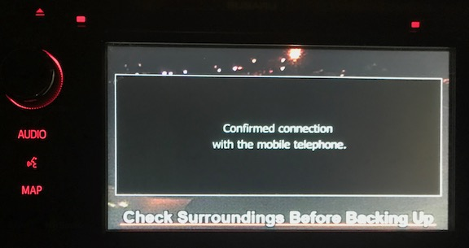
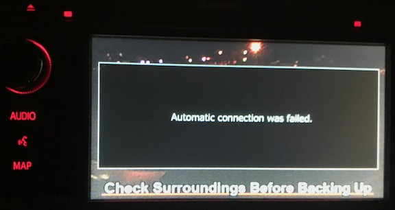

# Vehicle Backup Camera System

As a driver, I like to use my vehicle's backup camera system to see objects behind the vehicle while backing out of a car port or parking space.  This visibility is extremely useful as it can help to ensure safe movement of the vehicle.  Engaging the camera is efficient; placing the transmission in reverse automatically switches the LCD display of the audio system to the video feed from the camera.

There is one problem however which makes it less effective and less safe.  When bluetooth is enabled, a notification is displayed on the LCD display on the audio system.  It usually takes a minute, give or take, for the bluetooth connection to register.  Invariably, the notification appears while backing up, which blocks the video feed from the camera.  This forces the driver to stop movement until the notifications clears and the view is restored.

It is odd that the information message would take precedence over the tool that is supposed to allow the to safely operate the vehicle. A further annoyance is that if bluetooth fails, such as if it is disabled on the device, another blocking alert appears that the automatic bluetooth connection failed,

This means that when loaning the car to someone, you must alert them that the vehicle backup camera view may become obscured, unless you disable bluetooth in the vehicle.  It is almost amusing that the dialog box is so large, for such a small amount of text, obviously considering it of significant importance to the driver.

