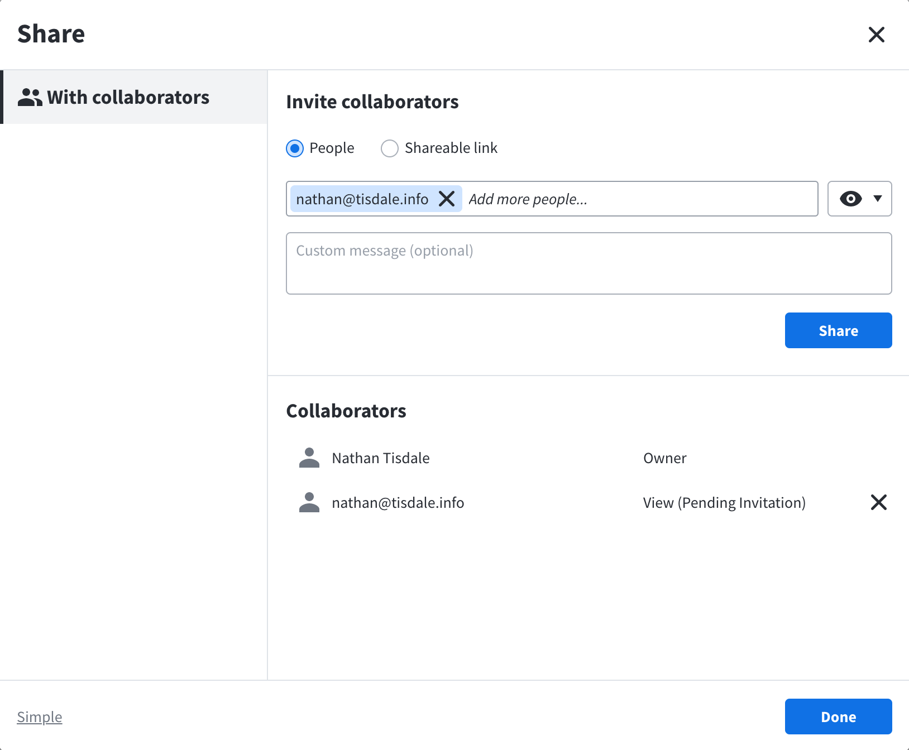
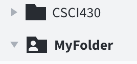
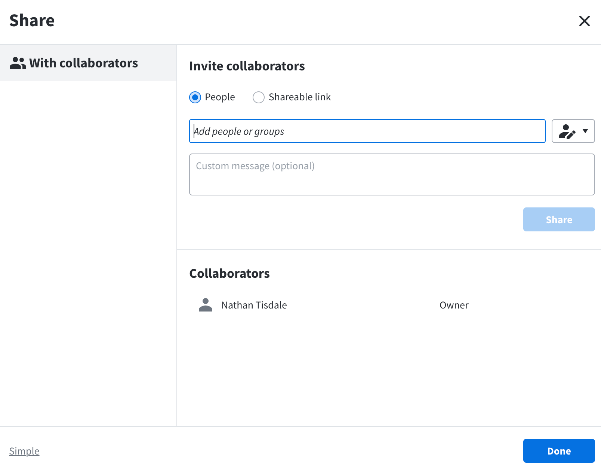

# Failure to Indicate State

LucidChart is an online application for creating diagrams. I have used it to create diagrams for several projects. The positive aspects are:

* _Efficiency_ - The ability to search the library of predefined shapes earns a point for efficiency. For example, one can search for ‘UML’ to find all shapes that one might use for different Unified Modeling Language (UML) diagrams.
* _Utility_ - Having used LucidChart to create a variety of diagrams for five classes, as well as work, I appreciate the utility offered by this tool
* _Learnability_ - numerous examples templates help illustrate how to create different types of diagrams, including UML
* _Fault Tolerant_ - LucidChart allows all diagrams to be backed up on a single export operations, which provides the ability to restore diagrams in the event of a loss This feature provides the added utility of being able to import diagrams into another account.

Sharing is one area which impacts an otherwise satisfying user experience.  Specifically, there is failure in indicating the state of sharing after sharing a folder.  At first, using the Advanced Sharing dialog to invite a collaborator, Lucid shows an accurate list of collaborators and their _status_.

Unfortunately, the problem starts after the user accepts the invitation.  The folder icon does change to indicate that the folder is shared.  The image below illustrates the addition of a figure to the folder icon that indicates ‘MyFolder’ is being shared.

However, when one opens the sharing dialog, the collaborators are not listed, as illustrated below.  This leaves the folder owner with the knowledge that the folder is shared, but not whom the folder is shared with. 

Aside from not having an accurate list of collaborators, this _missing state information_ prevents one from removing a collaborator.  This might not be a significant issue with diagrams for a school project, but could be a major problem for an organization requiring compliance with FERPA or HIPAA.   Depending on the data included in a shared folder, this could impact compliance or even personal _safety_ if access controls were not appropriately updated after an employee role changed.
